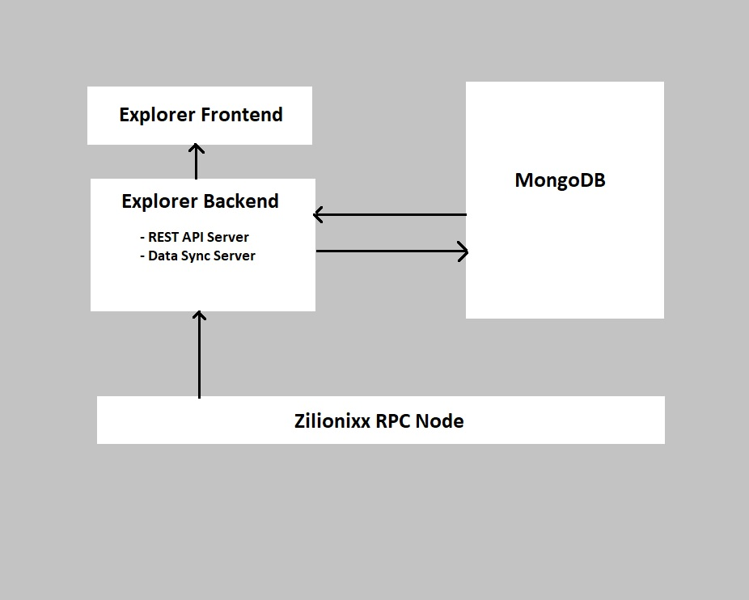

# [Zilionixx Block Explorer](https://blockexplorer.zilionixx.com)


[](https://gitter.im/ZilionixxCommunity/ZNXscan)
[](https://matrix.to/#/#zilionixx:matrix.org)
[](https://discord.gg/W42fMxYK)


# Zilionixx Blockchain Explorer

A Javascript web app for users to explore and analyze the Zilionixx blockchain.

Its frontend is a single page application using reactjs and its backend uses Node.js.

Please visit https://blockexplorer.zilionixx.com/ to view all data in Zilionixx.

## Block Explorer Design Overview



### Explorer Frontend

It's a web app using [reactjs](https://reactjs.org/) serves as the presentation layer for the Zilionixx blockchain explorer.

### Explorer Backend

Checkout [this repository](https://github.com/zilionixx/zilionixx-block-explorer-api) for Zilionixx block explorer's backend repository.

## Decide what to do

As a beginner, you may want to pick an issue from issues with **help wanted** or **good first issue** tag and make a pull request for your changes.

After being more familiar with the explorer and the code, you can submit improvement ideas and work on those ideas.

Please set the base branch as `staging` when you create a new pull request

## Git workflow

### Step 1: Clone git repo to your local

You can clone https://github.com/zilionixx/zilionixx-block-explorer.git and commit to it if you are a key contributor.

```shell
git clone https://github.com/zilionixx/zilionixx-block-explorer.git
```

Or you can fork git clone https://github.com/zilionixx/zilionixx-block-explorer.git and clone your forked repo.

### Step 2: Make some changes

1. Create a new branch for your change, use prefix "hotfix/" for bug fix, "feature/" for feature.
2. Make the change and commit with good commit message

### Step 3: Get the change merged

1. Push your local changes to remote repo
2. Create the pull request if you are using forked repo
3. Address review feedback and get the change merged

# Environment Setup

## Step 1: Install Node.js

1. Install lastest node.js so you can execute 'npm' command by either downloading zip or installer from https://nodejs.org/en/download/ or via [package manager](https://nodejs.org/en/download/package-manager/)

### Step 2: Build and Run

```bash
# install dependency
npm i

# run webpack dev build on localhost
npm run start

# open http://localhost:8080/ in browser
# config port number in explorer-front/config/index.js!dev.port

# run webpack production build, results will output to 'dist' folder
npm run build
```
